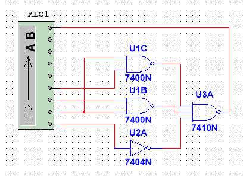
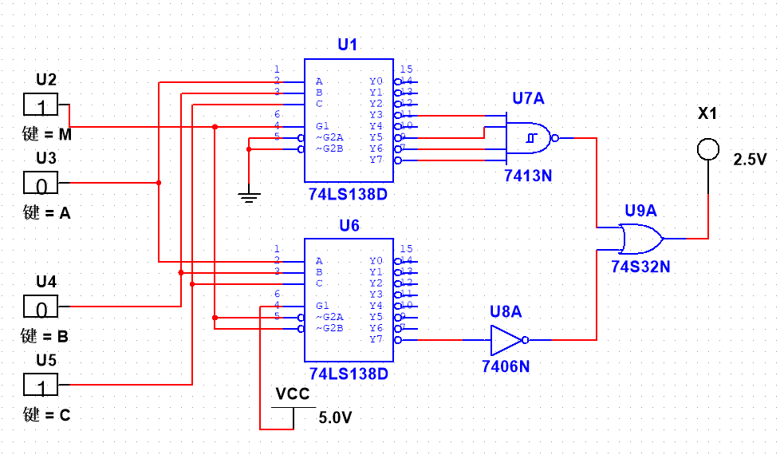

# 实验1 实验报告

## 一、实验目的

- 了解 EDA 技术的发展、应用概述。
- 掌握 Multisim 2001 软件的使用，完成对电路图的仿真测试。

## 二、实验电路

### 四舍五入电路

### 表决电路

## 三、实验软件与环境

- 实验软件：Multisim 14.3

## 四、实验内容与步骤

1. 了解元件工具箱中常用的器件的调用、参数选择。
2. 调用各类仿真仪表，掌握各类仿真仪表控制面板的功能。
3. 完成四舍五入判别电路（其输入为 8421 BCD 码，要求当输入大于或等于 5 时，判别电路输出为 1，反之为 0。只能用与非门实现）。
	1. 画真值表。
	2. 作卡诺图，画圈。
	3. 用第 2 步结果，得到表达式。
	4. 化为与非表达式。
	5. 画电路图。
4. 设计一个表决电路，当控制端 M 为 0 时，输入端 A、B、C 一致同意时，输出 F 为 1，否则输出为 0；当控制端 M 为 1 时，输入端 A、B、C 多数同意时，输出 F 为 1，否则输出为 0。要求用 3 线-8 线译码器 74LS138 和必要的门电路实现。
	1. 画真值表。
	2. 考虑到有 M、A、B、C 四个输入，我们需要用两个 74LS138 译码器来实现一个 4 线-16 线的译码器。我们选择用 M 来决定使用哪个 74LS138 译码器处理 ABC 三位输入，ABC 分别接到两个译码器的 ABC 输入端。
	3. 根据真值表，处理两个译码器的输出端。
	4. 用 LED 灯检查电路的电平输出情况。

### 四舍五入判别电路（8421 BCD）

- 输入符号说明：`A B C D` 分别表示 8、4、2、1 位（A 为最高位 8）。输出记为 `Y`。

- 真值表（只列出合法 BCD 0~9）：

| 十进制 | A | B | C | D | Y |
|---:|:-:|:-:|:-:|:-:|:-:|
| 0 | 0 | 0 | 0 | 0 | 0 |
| 1 | 0 | 0 | 0 | 1 | 0 |
| 2 | 0 | 0 | 1 | 0 | 0 |
| 3 | 0 | 0 | 1 | 1 | 0 |
| 4 | 0 | 1 | 0 | 0 | 0 |
| 5 | 0 | 1 | 0 | 1 | 1 |
| 6 | 0 | 1 | 1 | 0 | 1 |
| 7 | 0 | 1 | 1 | 1 | 1 |
| 8 | 1 | 0 | 0 | 0 | 1 |
| 9 | 1 | 0 | 0 | 1 | 1 |

- 卡诺图（AB 为行，CD 为列，采用 Gray 码顺序 00,01,11,10）：

| AB\CD | 00 | 01 | 11 | 10 |
|:-:|:-:|:-:|:-:|:-:|
| 00 | 0 | 0 | 0 | 0 |
| 01 | 0 | 1 | 1 | 1 |
| 11 | - | - | - | - |
| 10 | 1 | 1 | - | - |

- 化简结果：

$$
Y = A + B(C + D)
$$

- 与非表达式（仅用 A、B、C、D）：

$$
Y = \overline{\overline{A} \cdot \overline{B C} \cdot \overline{B D}}
$$

### 表决电路（控制端 M，输入 A,B,C）

- 逻辑说明：
	- 当 `M` 为 0：要求“三人一致同意时输出为 1”，这里解释为三人都为 1（即 A、B、C 同为 1）时输出 1；其余情况为 0。即一致同意表示一致为“同意(1)”。
	- 当 `M` 为 1：要求“多数同意时输出为 1”，即当三输入中至少有两个为 1 时输出 1（多数为 1）。

- 综合布尔表达式：

$$
F = M \cdot (AB + AC + BC) + \overline{M} \cdot (ABC)
$$

- 真值表（列出所有 M, A, B, C 的组合，共 16 行）：

| M | A | B | C | F |
|:-:|:-:|:-:|:-:|:-:|
| 0 | 0 | 0 | 0 | 0 |
| 0 | 0 | 0 | 1 | 0 |
| 0 | 0 | 1 | 0 | 0 |
| 0 | 0 | 1 | 1 | 0 |
| 0 | 1 | 0 | 0 | 0 |
| 0 | 1 | 0 | 1 | 0 |
| 0 | 1 | 1 | 0 | 0 |
| 0 | 1 | 1 | 1 | 1 |
| 1 | 0 | 0 | 0 | 0 |
| 1 | 0 | 0 | 1 | 0 |
| 1 | 0 | 1 | 0 | 0 |
| 1 | 0 | 1 | 1 | 1 |
| 1 | 1 | 0 | 0 | 0 |
| 1 | 1 | 0 | 1 | 1 |
| 1 | 1 | 1 | 0 | 1 |
| 1 | 1 | 1 | 1 | 1 |

- M 平面化简（可分别对 M 为 0 和 M 为 1 两个平面做卡诺图）：
	- 当 `M` 为 0：仅在 A、B、C 全为 1 时 F 为 1，表达式为：

		$$
		F_0 = ABC
		$$

	- 当 `M` 为 1：当 A、B、C 中至少有两个为 1 时，表达式为：

		$$
		F_1 = AB + AC + BC
		$$

## 五、实验结果

- 成功使用与非门实现了一个四舍五入电路，电路能够根据 8421 BCD 输入正确输出判别结果，并通过逻辑变换器中的真值表完成了功能验证。
- 成功使用 3 线-8 线译码器 74LS138 实现了一个表决电路，电路能够根据控制端 M 的取值切换不同判决逻辑，并借助交互式数字源和红色指示灯完成了结果检验。
- 两个电路在仿真过程中均能稳定工作，说明所采用的逻辑化简和器件连接方式是正确的，满足实验要求。

## 六、收获、体会与建议

- 通过本次实验，我进一步熟悉了 Multisim 的基本操作，包括元器件调用、连线、参数设置以及仿真结果观察，能够更熟练地完成从逻辑表达式到电路图的转换。
- 实验让我更加明确了数字电路设计的基本思路：先分析需求，再列出真值表，随后进行逻辑化简，最后选择合适的器件完成实现。这个过程比直接搭建电路更重要，也更能保证结果的正确性。
- 在四舍五入电路中，我体会到卡诺图化简和与非门实现之间的衔接关系，理解了为什么同一个逻辑功能可以用不同形式的门电路表达出来。
- 在表决电路设计中，我对 74LS138 的译码特性和输出组合方式有了更深的理解，也加深了对控制端参与逻辑选择这一设计方法的认识。
- 通过反复调试电路连接和观察仿真输出，我意识到数字电路实验中细节非常关键，哪怕是一个输入端接错或逻辑取反错误，都可能导致最终结果不符合预期。
- 这次实验不仅巩固了课堂上学到的理论知识，也提升了我独立分析问题和排查电路错误的能力，为后续更复杂的时序逻辑电路设计打下了基础。