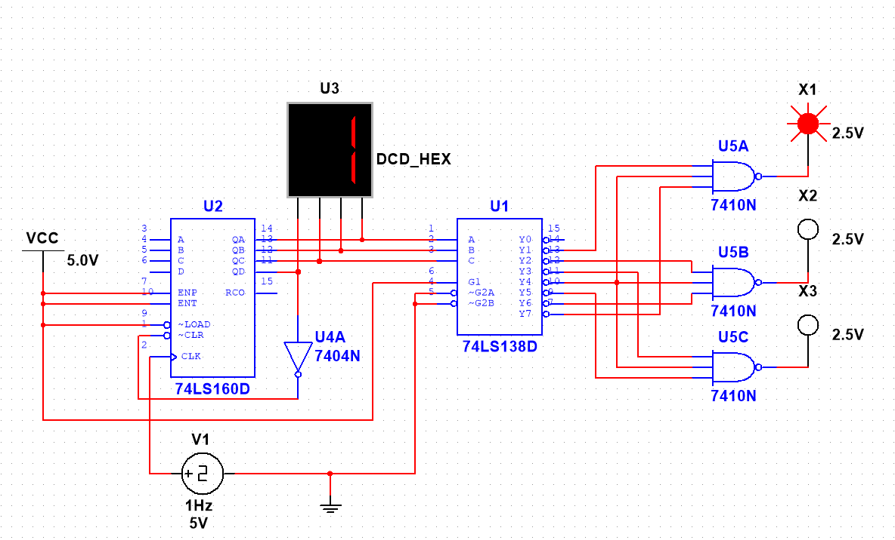

# 实验2 实验报告

## 一、实验目的

1. 掌握中规模集成寄存器构成的时序逻辑电路的设计方法。
2. 掌握中规模集成计数器设计 N 进制计数器的方法。
3. 学会用时序功能器件构成综合型应用电路。

## 二、实验电路

### 电路组成与工作原理

1. **计数器模块**：采用 74LS160 同步十进制计数器，通过异步清零法实现八进制计数。
   
2. **译码器模块**：采用 74LS138 三线-8线译码器。
   
3. **灯光控制模块**：利用与非门进行逻辑组合，根据状态转换表，将 74LS138 的相应输出端与灯相连，实现红、绿、黄三盏灯按规定顺序切换

### 工作流程

- 初始化后，计数器从 0 开始计数
- 每个时钟周期计数增加 1，对应的译码输出相应改变
- 当计数到 8 时，异步清零电路被触发，计数器立即清零并重新开始计数
- 通过这个循环过程，实现灯光状态的周期性转换

## 三、实验软件与环境

- 实验软件：Multisim 14.3

## 四、实验内容与步骤

### 实验内容

用 74LS160 和 74LS138（3 线-8 线译码器）和必要的门电路设计一个灯光控制逻辑电路。

- 要求红、绿、黄三种颜色的灯在时钟信号作用下按下表规定的顺序转换状态。表中的 1 表示“亮”，0 表示“灭”。要求电路能自启动。
- 三个灯接到 LED 上进行显示。

### 实验步骤

1. 使用 74LS160 完成八进制计数器。
	1. 使用异步清零法，Qd 连接非门之后与 CLR 相连，实现满 8 归零，并且能自启动。
	2. 将 Qc、Qb、Qa 连接到数码管上，实现计数结果的显示。
2. 将 74LS160 与 74LS138 相连，实现灯光控制逻辑电路。
	1. 将 74LS160 的输出端 Qc、Qb、Qa 分别连接到 74LS138 的 C、B、A 输入端。
	2. 根据表中要求，使用与非门将 74LS138 的输出端按要求与灯相连。

## 五、实验结果

- 成功使用 74LS160 和 74LS138 实现了一个灯光控制逻辑电路，电路能够按照设定的时钟节拍稳定切换红、绿、黄三种灯的状态，下方视频为实验结果。
- 通过仿真可以看出，计数器部分能够正常循环计数，译码器部分能够根据计数状态输出对应的灯光控制信号，说明整体电路设计能够满足实验要求。
- 电路具备自启动能力，初始状态下也能够逐步进入正确的工作序列，验证了异步清零和译码控制方案的可行性。

## 六、收获、体会与建议

- 通过本次实验，我对 74LS160 的计数功能和清零方式有了更直观的认识，理解了如何利用计数器的输出状态构造指定进制的循环控制电路。
- 我进一步掌握了 74LS138 译码器在时序控制中的应用方式，明白了如何将计数结果转换为具体的控制信号，并据此驱动不同输出端。
- 在搭建灯光控制逻辑电路的过程中，我体会到时序电路设计不仅要关注逻辑关系，还要关注电路的初始状态、循环过程和自启动能力，这些因素都会影响最终效果。
- 实验强化了我对时序逻辑电路“状态转换”和“输出控制”两个核心概念的理解，也提升了我综合运用计数器、译码器和门电路解决实际问题的能力。
- 通过调试和观察仿真波形，我更加熟悉了先分模块设计、再整体联调的思路，这对后续完成更复杂的数字系统设计很有帮助。