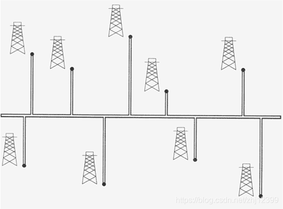

# 1. 油井问题


主油管道为东西向，确定主油管道的南北位置，使南北向油井喷油管道和最小。要求线性时间完成。



1<= 油井数量 <=2 000 000

输入要求：

输入有油井数量行，第 K 行为第 K 油井的坐标 X ,Y 。其中，$0<=X<2^{31}, 0<=Y<2^{31} 。$ 

输出要求：

输出有一行， N 为主管道最优位置的最小值

注意：用快速排序做的不给分！

友情提示：可以采用while(scanf("%d,%d",&x,&y) != EOF)的数据读入方式。

输入：
```
41,969978
26500,413356
11478,550396
24464,567225
23281,613747
491,766290
4827,77476
14604,597006
292,706822
18716,289610
5447,914746
```

输出：
```
597006
```

时限：64M  
内存：0  

> 来源: https://lexue.bit.edu.cn/mod/programming/view.php?id=535307