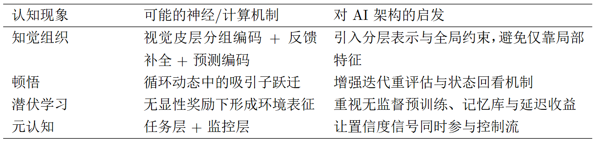

### 1. 试着用生物学角度解释韦特海默提出的5条知觉律

我理解，接近、相似、连续、闭合、良好图形这5条知觉律，本质上都对应大脑的“高效编码”原则。视觉皮层会把时空上相关的刺激优先绑定，减少计算负担；前馈与反馈回路共同完成边界补全和整体预测，所以我们常先看到“有意义的整体”，再分辨局部细节。

### 2. 试着用反馈神经网络解释顿悟的过程。对比当前神经网络架构有什么启发？

我认为顿悟像是反馈网络里的“状态突变”：系统先在局部最优附近反复迭代，累积到阈值后突然跳到更稳定的全局解释。它启发当前架构要重视循环与重评估机制。相比只做一次前向传播，带反馈的结构更接近人类“卡住-重组-突然想通”的过程。

### 3. 试着用神经网络解释潜伏学习实验结果。有什么启发？

我理解潜伏学习说明：即使没有即时奖励，网络也会在探索中形成内部表征。等到目标或奖励出现，这些表征会被快速调用，表现为“突然学会”。启发是训练不应只盯短期回报，还要重视无监督预训练、世界模型与记忆模块的长期价值。

### 4. 扩展问题：神经网络产生“元认知”的机理？

我认为“元认知”可以理解为网络对自身认知过程的再建模。第一层是任务层，负责感知、推理与决策；第二层是监控层，持续评估任务层输出是否可靠，比如置信度是否过低、信息是否冲突、是否需要继续搜索证据。这个结构有点像“我在想什么”之外，再加一个“我判断我想得对不对”的系统。

从机制上看，元认知可能来自三类信号：一是误差历史（过去在哪类题上容易错）；二是不确定性估计（当前结论有多稳）；三是策略成本（继续思考是否值得）。当监控层发现高风险低把握时，会触发策略切换，例如延迟回答、请求更多信息、改用慢推理路径。这样，网络不只是给答案，而是能管理自己的求解过程。

局限也很明显：当前很多模型的“自我评估”仍可能是表面一致性，不等于真正理解。因此我觉得元认知的关键不只是加一个评分头，而是让监控信号真正回流并改变后续计算路径。

